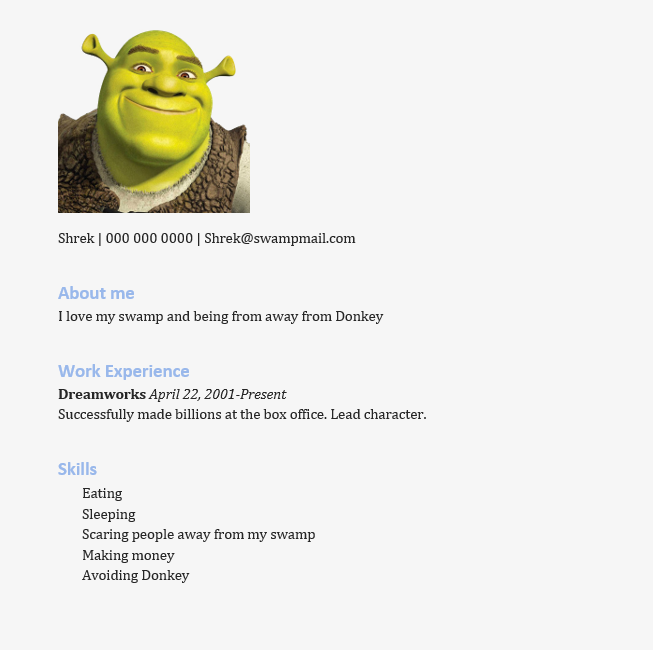

# Simple Resume Builder

This is a simple resume builder made using the docx import in Python. The program works by asking the user a set of questions such as work experiences and skills, and then taking the user's input and putting them into an MS Word document. The user must strictly follow the prompts, as this is not a total solution. To add your own picture of choice, you  have to edit the code to match the name of your picture file to that within the code. Please note the picture must be within the same directory. e.g. 'Picture.doctype' must match 'Picture.doctype' as well as being in the same filepath. The file can also be saved as a different doc type by changing the suffix of the save command.
